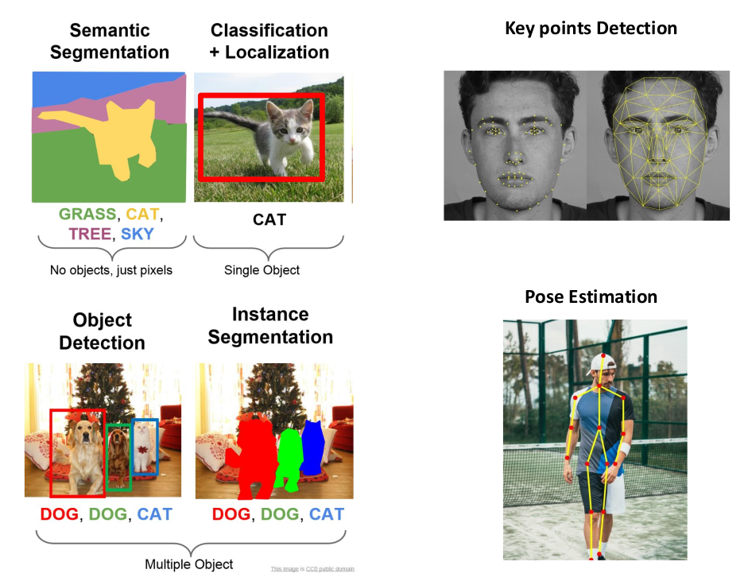
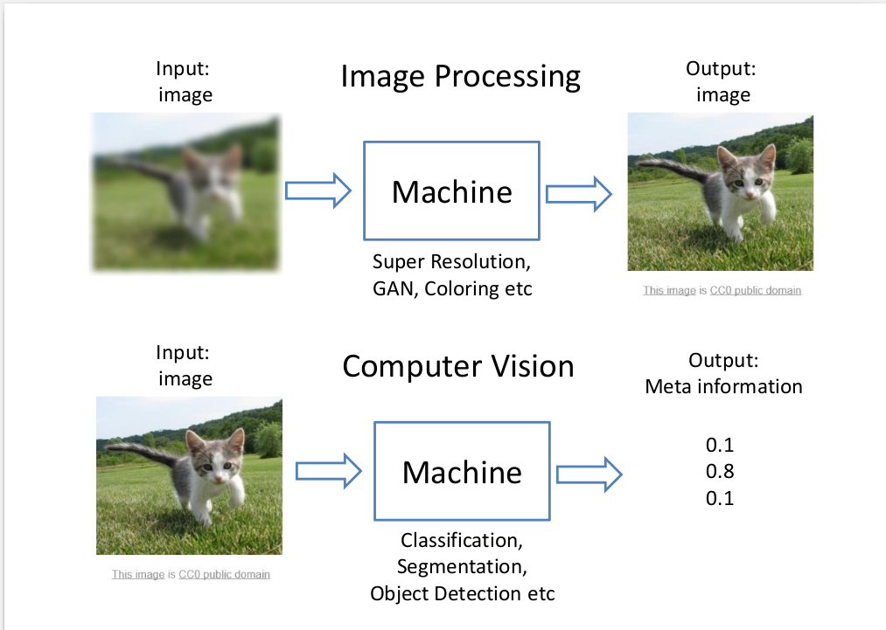

# Assignment 6

В прошлом задании мы научились эффективным техникам обучения нейросетей для решения задач классификации изображений. В этом задании мы рассмотрим более продвинутые задачи Computer Vision.

Под задачами Computer Vision подразумевают извлечение некоторой полезной информации из изображения. Если на входе и на выходе алгоритма ожидается изображение, то такие задачи относят к Image Processing (IP). Многие задачи IP решаются классическими методами, однако такие задачи как генерация изображений (Generative Adversarial Networks, GAN), повышение разрешения изображения (Super Resolution), раскраска старых фото видео вполне успешно решаются методами Deep Learning.  

В этом задании нужно будет реализовать Unet на pytorch и натренировать для решения задачи semantic segmentation.  

## Архитектура Unet

Срок сдачи - 15.04   23:59  

#### Dataset:
https://www.kaggle.com/dansbecker/cityscapes-image-pairs

#### References:
* https://arxiv.org/pdf/1603.07285v1.pdf
* https://towardsdatascience.com/u-net-b229b32b4a71