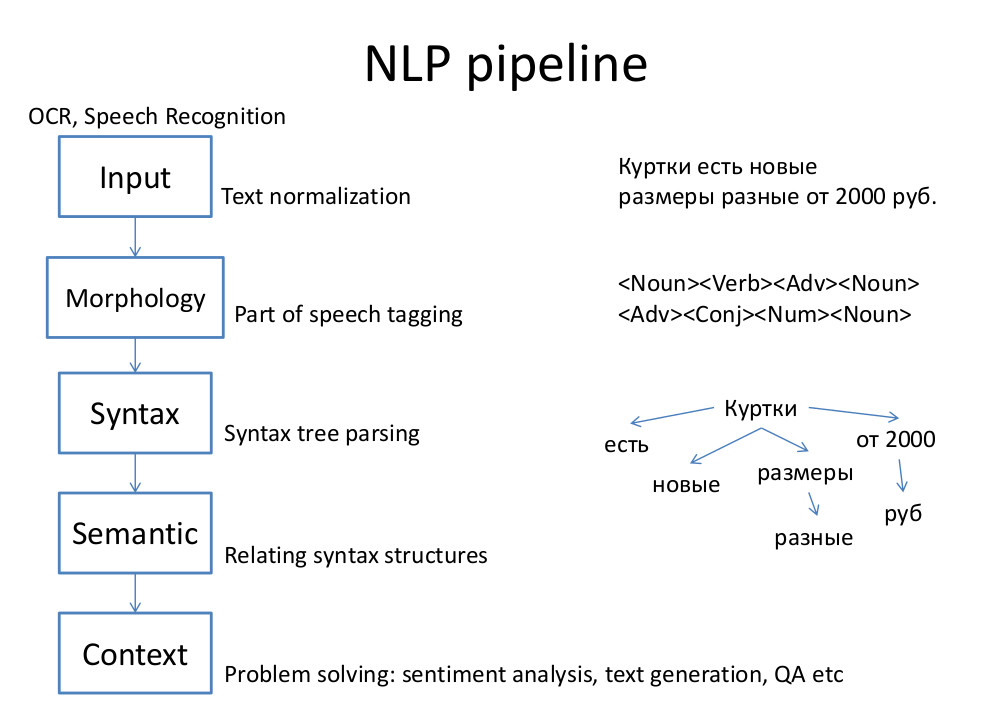
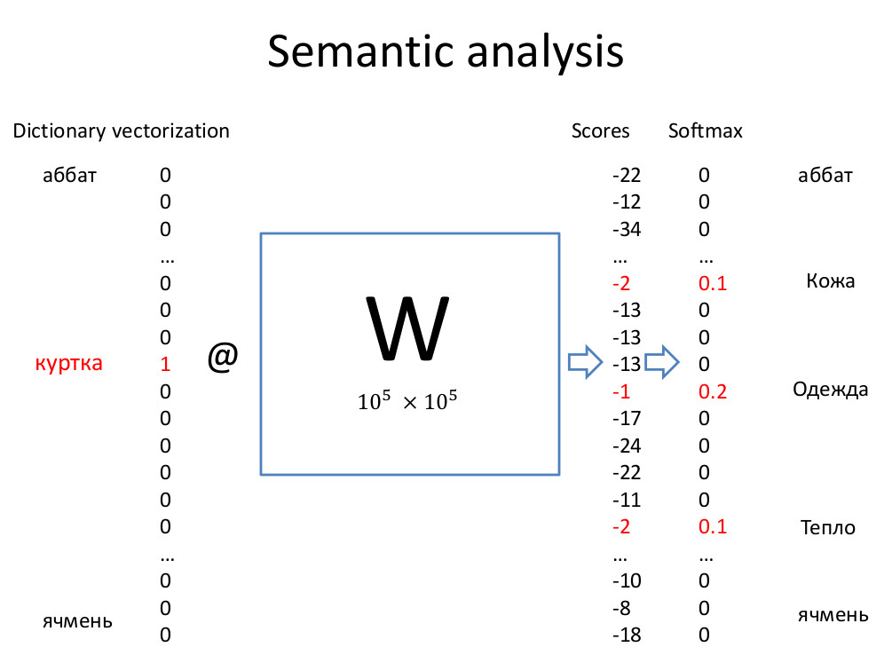
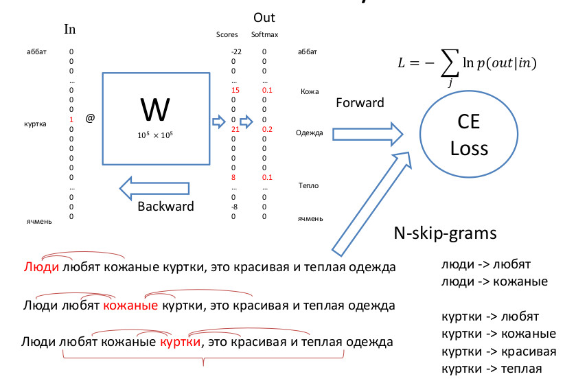
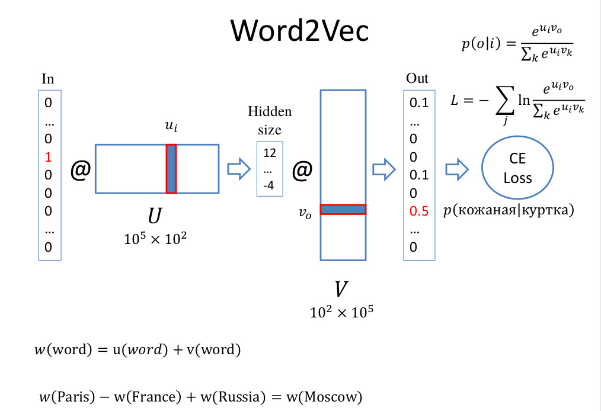
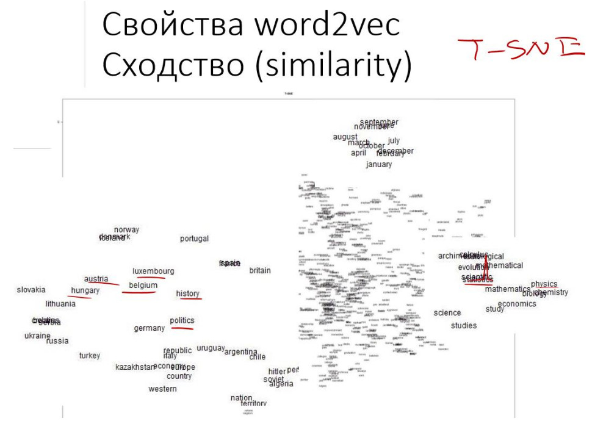

# Задание 7

В этом задании мы натренируем свои собственный word2vec.  

В общем виде процесс обработки текста выглядит следующим образом.  

Семантический анализ слова - это выделение смысловых отношений с другими словами в словаре. Для каждого слова в словаре вычисляется оценка вероятности того, что оно является близким по смыслу заданному.  
В простейшем случае слово кодируется с помощью One Hot Encoding. Имеется матрица весов W, элементы которой и являются этими оценками вероятностей. 

Веса матрицы W находятся с помощью алгоритма N-skip grams. Берется большой корпус текста, из которого по очереди берется по одному слову. Считается, что близкими по смыслу будут те слова, которые находятся рядом с ним. Для каждой пары слов делается One Hot Encoding и вычисляется Cross Entropy Loss. Затем веса матрицы W обновляются с помощью механизма back propagation. 

Т.к. размер реальных словарей достаточно велик, то иметь дело с большой матрицей W не очень удобно. Для этого используется декомпозиция W на две матрицы U V меньших размеров DxH и HxD, где D - размер словаря, H - размер скрытого слоя. Никаких нелинейных преобразований пока не производится, только вектор-матричные умножения.

В результате элементы вектора меньшего размера (Hidden Size) как бы накапливают в себе скрытый смысл или похожесть слов (similarity).  Поэлементное сложение столбца матрицы U и строки матрицы V дает нам embedding слова - его векторное представление в пространстве смыслов.

Чтобы скачать данные для тренировки используйте команды из скрипта `download_data.sh`. Далее следуйте инструкциям в ноутбуке Word2Vec.ipynb

Срок выполнения задания - 23:59 22 апреля.
